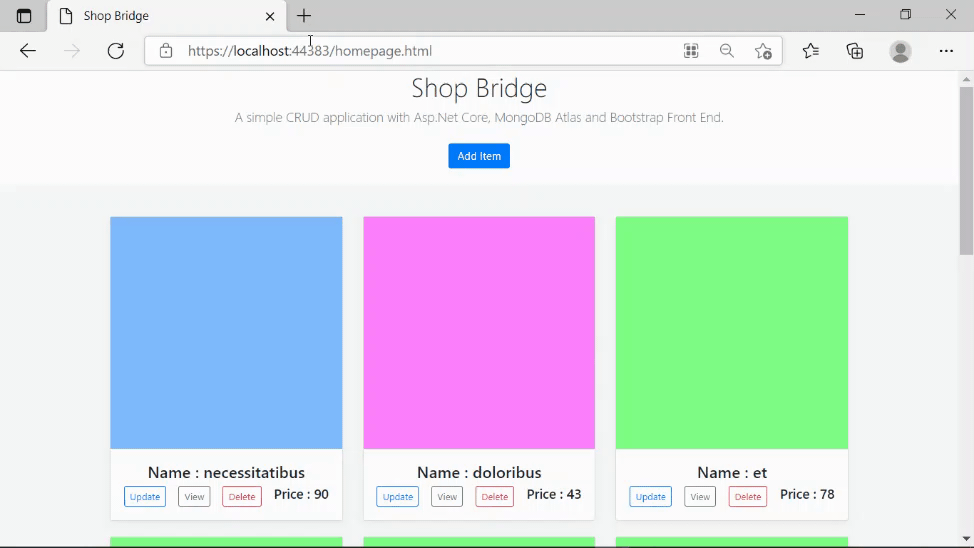

# Shop Bridge: A simple Inventory Management Application

This is a simple CRUD web application made with ASP.Net core, MongoDB and Bootstrap. The app backend was built first followed by construction of a single HTML page that consumes
the backend. So it is a SPA. It is responsive due to the Boostrap styling. The database is MongoDB Atlas hosted on cloud. The Database is populated with dummy "Lorem Ipsum" data
using Bogus.

# Back End Api features
- [x] Create
- [x] Read 
- [x] Update
- [x] Delete
- [x] Paginate
- [x] Search
- [x] Sort
- [x] Authenication (Incomplete)

# Front end features
- [x] Create UI
- [x] Read UI
- [x] Update UI
- [x] Delete UI
- [x] Paginate UI
- [ ] Search UI (Incomplete)
- [ ] Sort UI (Incomplete)
- [ ] Authentication UI (Incomplete)

# Preview 

   
   Refresh/Load and CRUD Preview

# Versions
* Asp.Net Core v3.1.201
* MongoDriver v2.13.0
* Boostrap v4.0
* Bogus v33.0.2
# Instructions To run
* Clone Repo 
* Open Solution using visual studio
* Restore Packages (If not done automatically) <code> dotnet restore </code>
* Run <code> DotNet Run </code>
